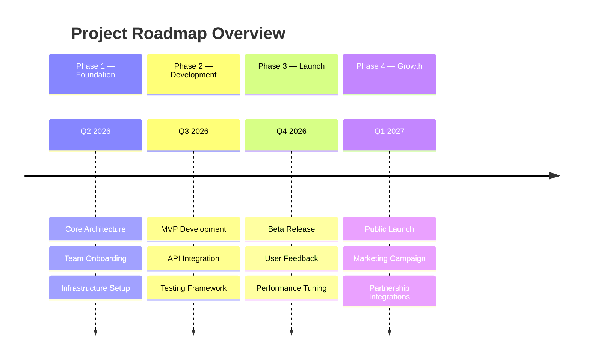
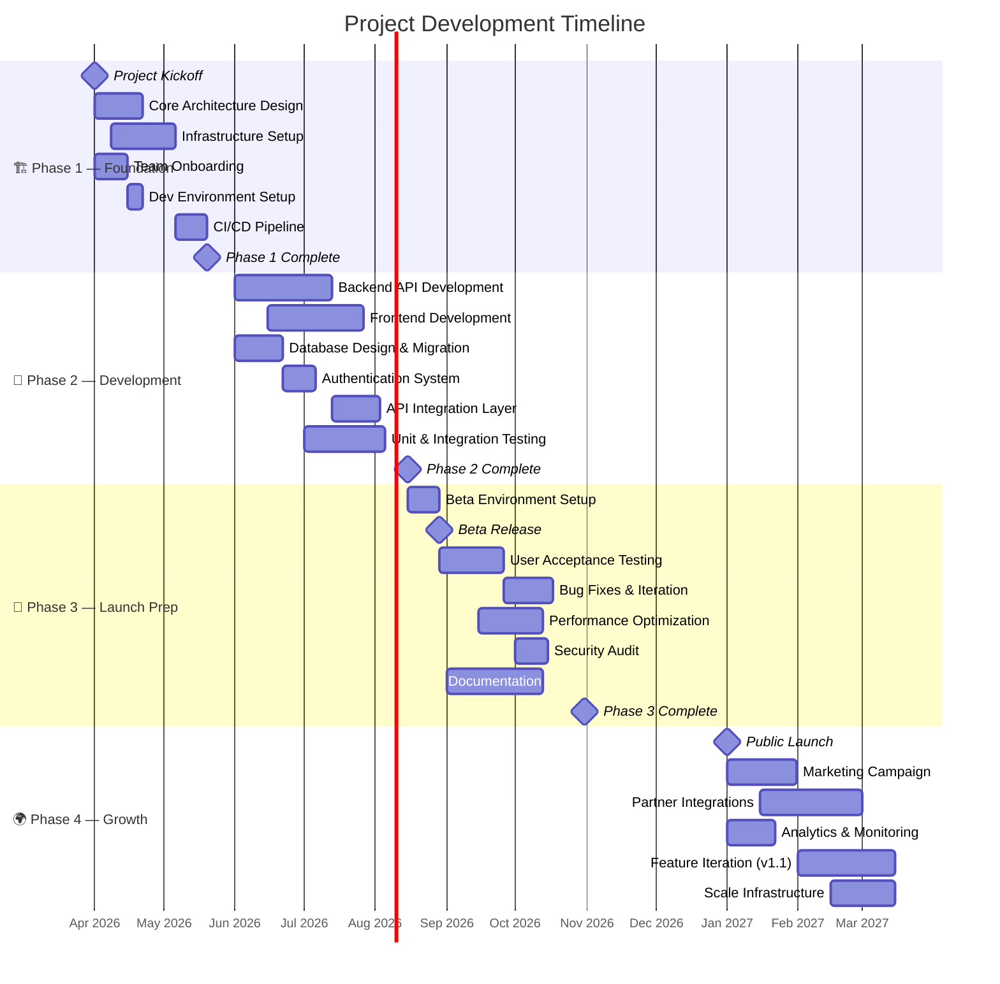
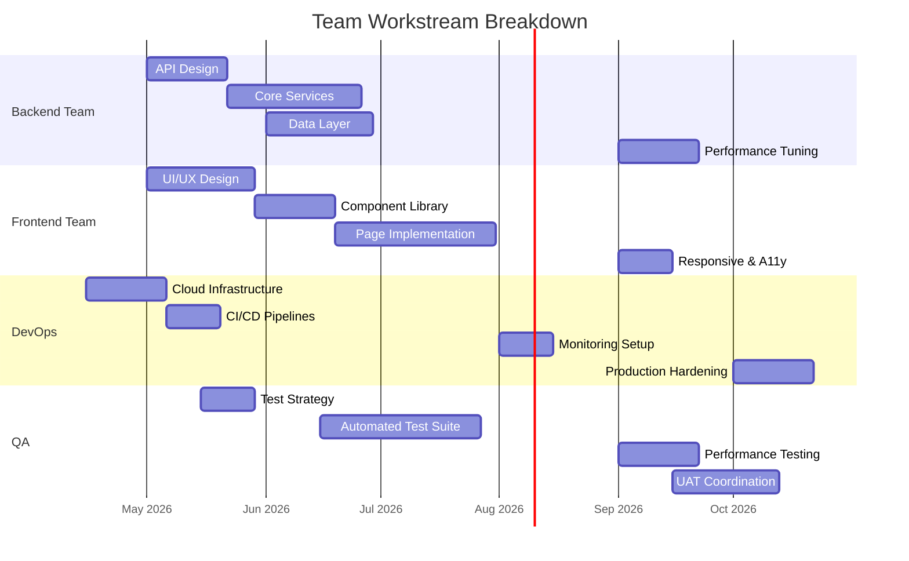
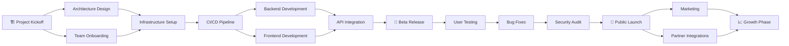
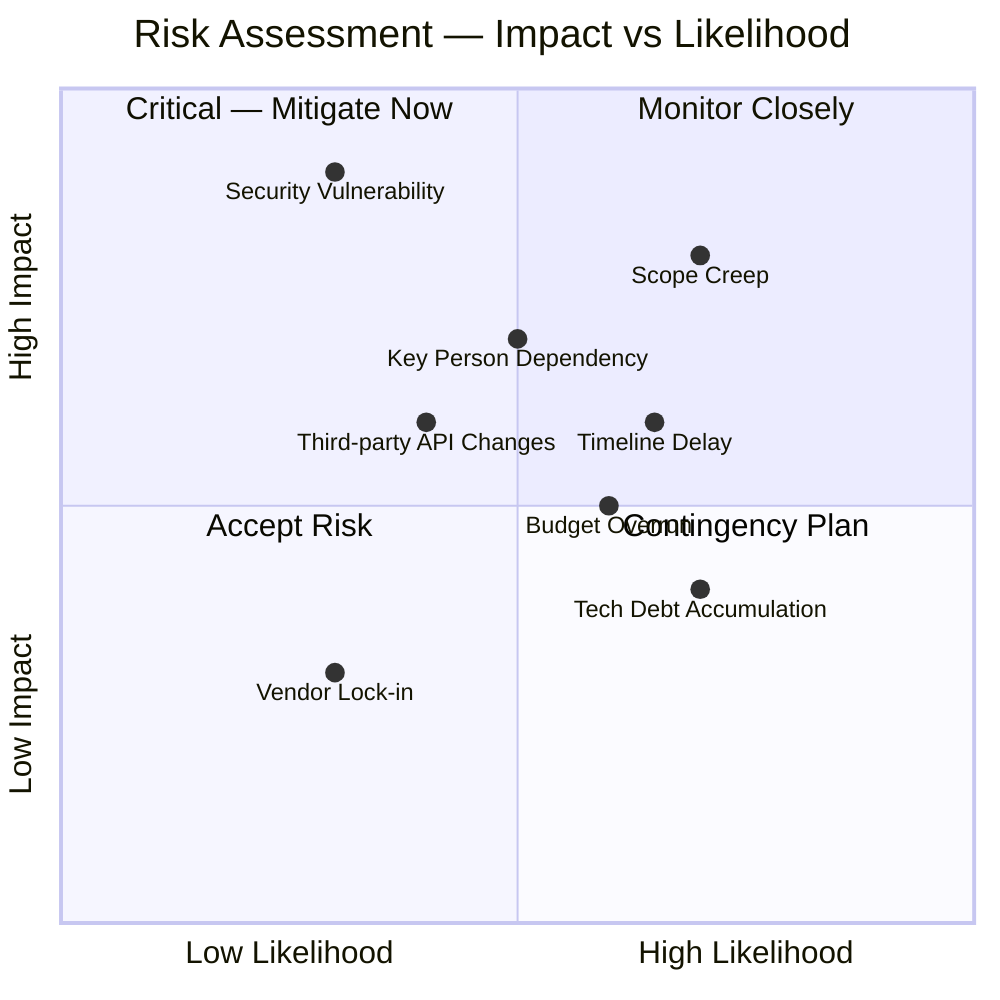
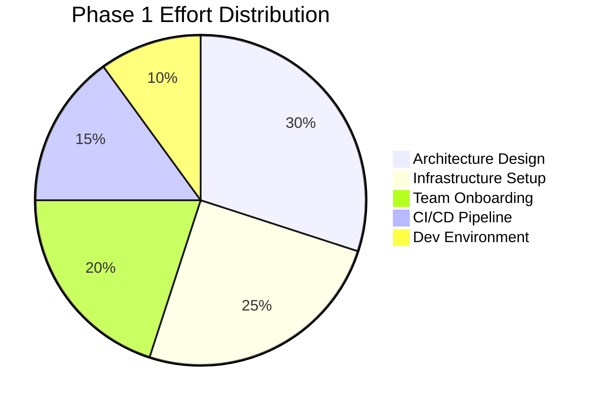

# 🗺️ Project Roadmap

> A comprehensive roadmap outlining milestones, timelines, and deliverables.

---

## Overview

---

## Detailed Gantt Chart

---

## Team Workstream Allocation

---

## Milestone Dependency Flow

---

## Risk Assessment Matrix

---

## Delivery Status Tracker

| Phase | Status | Target Date | Key Deliverables |
|-------|--------|-------------|-----------------|
| **Phase 1** — Foundation | 🟡 In Progress | Q2 2026 | Architecture, Infra, CI/CD |
| **Phase 2** — Development | ⚪ Not Started | Q3 2026 | MVP, APIs, Testing |
| **Phase 3** — Launch Prep | ⚪ Not Started | Q4 2026 | Beta, UAT, Security Audit |
| **Phase 4** — Growth | ⚪ Not Started | Q1 2027 | Launch, Marketing, Partners |

---

## Phase Detail Breakdown

### Phase 1 — Foundation (Q2 2026)

**Goals:**
- Define and document system architecture
- Provision cloud infrastructure (staging & production)
- Onboard all team members with access & tooling
- Establish CI/CD pipelines with automated testing gates

### Phase 2 — Development (Q3 2026)

**Goals:**
- Build core backend services and REST/GraphQL APIs
- Develop frontend with component-driven architecture
- Implement authentication, authorization, and data models
- Achieve 80%+ test coverage on critical paths

### Phase 3 — Launch Prep (Q4 2026)

**Goals:**
- Deploy beta environment and onboard beta testers
- Run user acceptance testing cycles
- Complete security audit and remediate findings
- Finalize documentation (API docs, user guides, runbooks)

### Phase 4 — Growth (Q1 2027)

**Goals:**
- Execute public launch with marketing push
- Integrate with strategic partners
- Set up analytics, monitoring, and alerting
- Plan and execute v1.1 feature iteration

---

## Version History

| Version | Date | Changes |
|---------|------|---------|
| 0.1 | 2026-03-19 | Initial roadmap creation |

---

*Last updated: March 19, 2026*
