# DecentralChain Ecosystem Roadmap

> Comprehensive development roadmap for the DecentralChain (DCC) blockchain ecosystem — SDK, wallets, DeFi, cross-chain bridges, CR Coin social economy, and web properties. Maintained by Blockchain Costa Rica / Decentral-America.

---

## Table of Contents

1. [Overview](#overview)
2. [Ecosystem Map](#ecosystem-map)
3. [Development Timeline](#development-timeline)
4. [Workstream Allocation](#workstream-allocation)
5. [Milestone Dependency Flow](#milestone-dependency-flow)
6. [Risk Assessment](#risk-assessment)
7. [Delivery Tracker](#delivery-tracker)
8. [Phase Details](#phase-details)
9. [Ecosystem Project Registry](#ecosystem-project-registry)
10. [Version History](#version-history)

---

## Overview

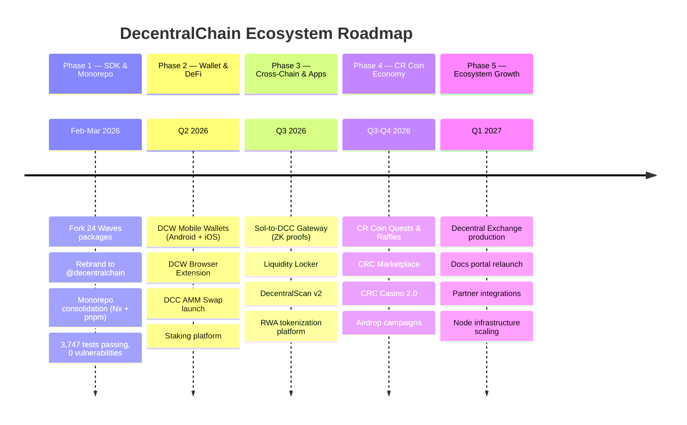

---

## Ecosystem Map

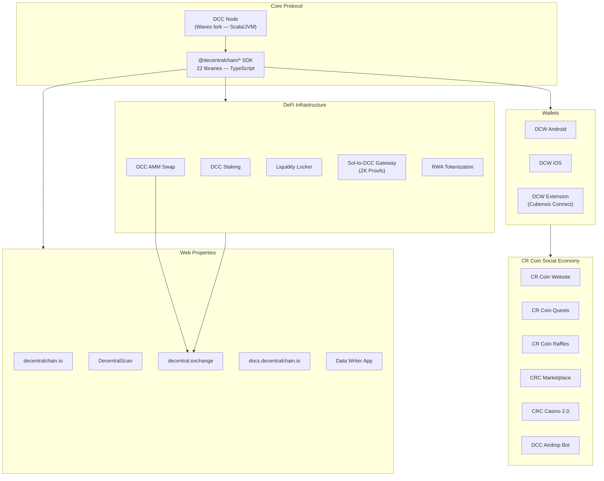

---

## Development Timeline

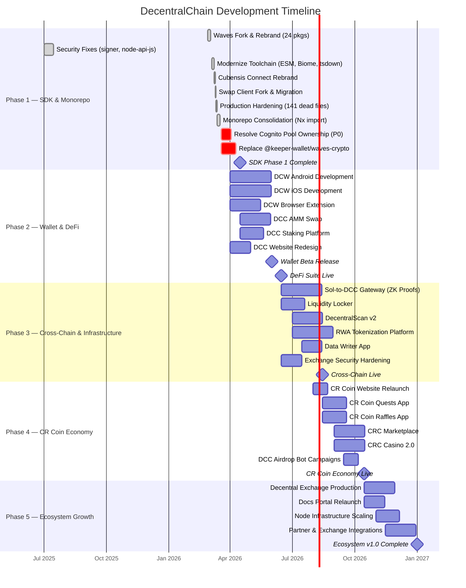

---

## Workstream Allocation

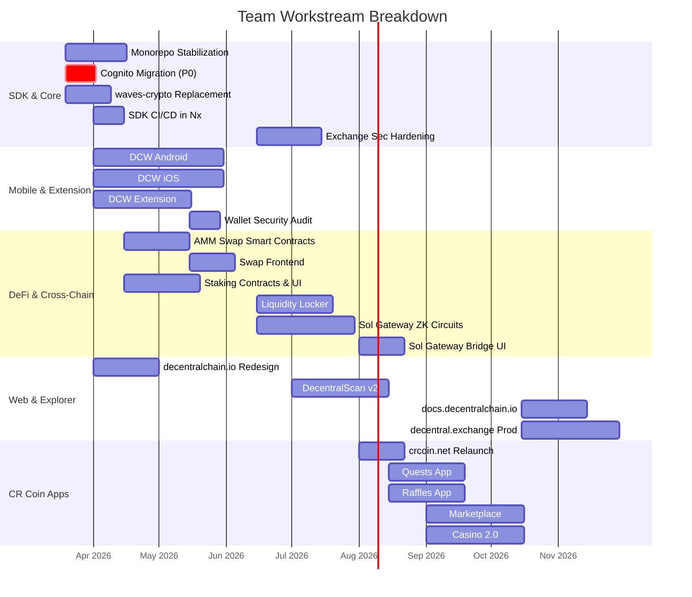

---

## Milestone Dependency Flow

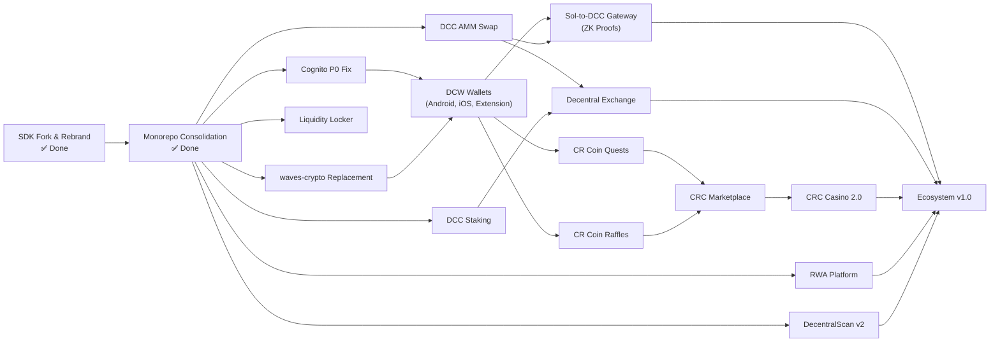

---

## Risk Assessment

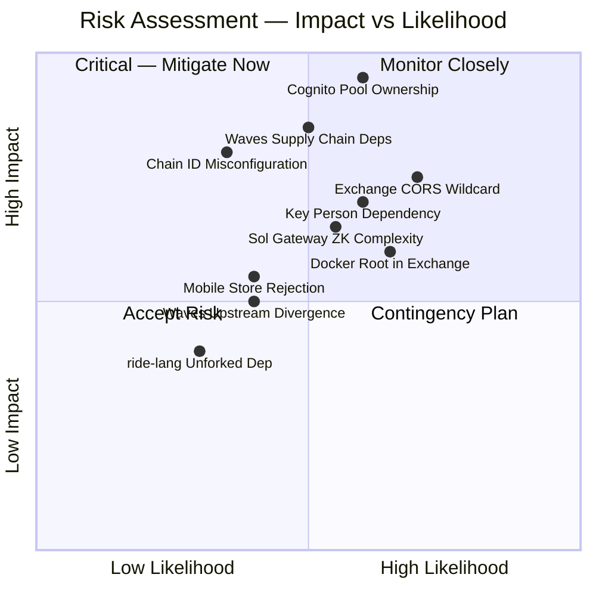

---

## Delivery Tracker

| Phase | Status | Target | Key Deliverables |
|-------|--------|--------|-----------------|
| **Phase 1** — SDK & Monorepo | 🟢 Complete | Mar 2026 | 22 SDK libs migrated, monorepo consolidated, 3,747 tests, 0 vulns |
| **Phase 1b** — Critical Fixes | 🔴 Blocked | Apr 2026 | Cognito P0 resolution, @keeper-wallet/waves-crypto removal |
| **Phase 2** — Wallet & DeFi | 🟡 In Progress | Q2 2026 | DCW Android/iOS/Extension, AMM Swap, Staking, decentralchain.io |
| **Phase 3** — Cross-Chain & Infra | ⚪ Not Started | Q3 2026 | Sol Gateway (ZK), Liquidity Locker, DecentralScan v2, RWA, Data Writer |
| **Phase 4** — CR Coin Economy | ⚪ Not Started | Q3-Q4 2026 | Quests, Raffles, Marketplace, Casino 2.0, Airdrop campaigns |
| **Phase 5** — Ecosystem Growth | ⚪ Not Started | Q1 2027 | decentral.exchange prod, docs relaunch, partner integrations |

---

## Phase Details

### Phase 1 — SDK & Monorepo (Feb–Mar 2026) — COMPLETE

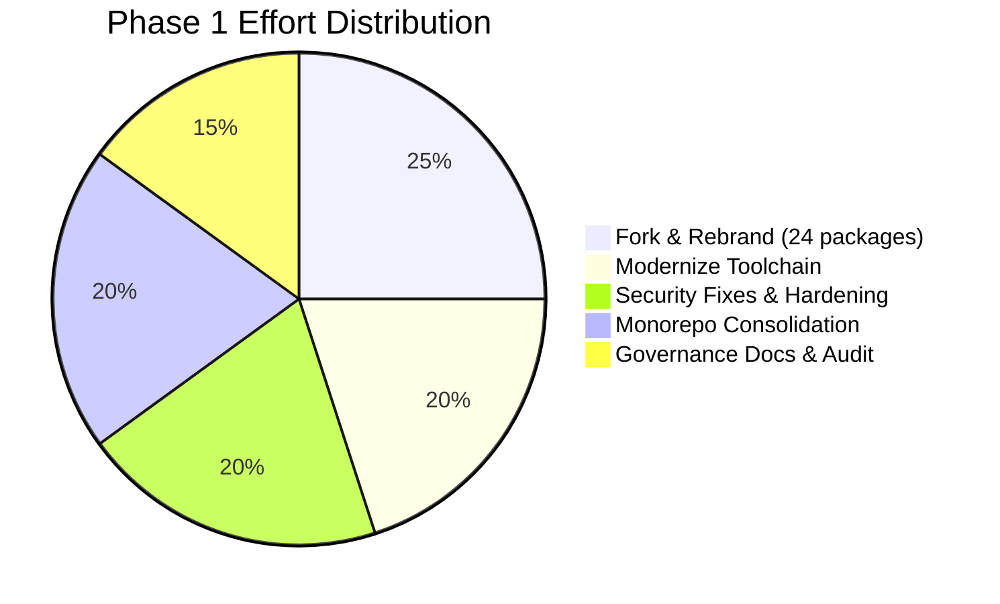

**Completed:**
- Forked 24 Waves packages → `@decentralchain/*` with full git history
- Modernized beyond upstream: ESM-only, TypeScript 5.9 strict, Biome 2.x, Vitest 4.x, tsdown
- Monorepo consolidated with Nx 22.x + pnpm 10.x (workspace protocol, computation caching)
- 3,747+ tests passing, 0 npm audit vulnerabilities, 0 `Math.random()` / `eval()` in src
- Cubensis Connect wallet extension rebrand (10 locales, icons, network URLs)
- Swap client reverse-engineered from deleted `@keeper-wallet/swap-client`
- 141+ dead files removed, `exactOptionalPropertyTypes` enabled in 19/24 packages

**Open Critical Items (Phase 1b):**

| Priority | Issue | Impact |
|----------|-------|--------|
| **P0** | AWS Cognito pools (`eu-central-1_AXIpDLJQx`, `eu-central-1_6Bo3FEwt5`) — verify DCC ownership or migrate | Waves could revoke access to user seeds |
| **P1** | `@keeper-wallet/waves-crypto` used in 21 files of cubensis-connect | Supply-chain risk — fork as `@decentralchain/wallet-crypto` |
| **P1** | `keeper-wallet.app` domains in cubensis-connect whitelist | Waves-controlled domains |
| **Medium** | `chainId` defaults to `'L'` in transactions & node-api-js, not DCC mainnet `'?'` | Wrong chain targeted by default |

---

### Phase 2 — Wallet & DeFi (Q2 2026)

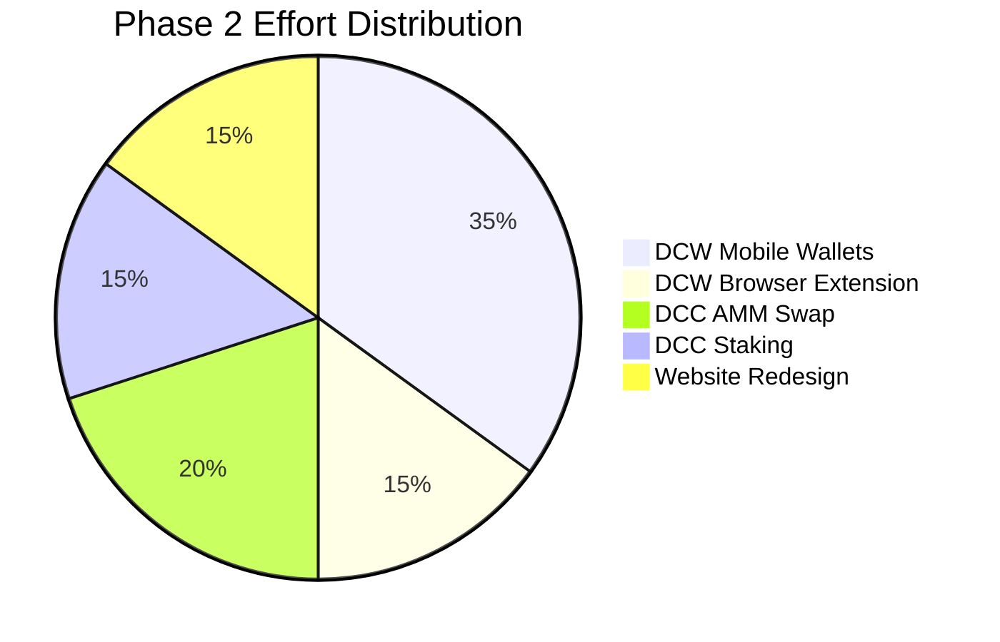

**Goals:**
- Launch DCW (DecentralChain Wallet) on Android and iOS with seed management, transaction signing, and DCC token support
- Ship DCW browser extension (evolution of Cubensis Connect with full modernization — webpack → Vite, Babel → native TS)
- Deploy DCC AMM Swap with constant product formula (on-chain Ride smart contracts)
- Launch DCC Staking platform with LPoS delegation and reward distribution UI
- Redesign decentralchain.io with ecosystem overview, wallet downloads, and developer onboarding

**Key Repositories:**
| Project | Repository | Target |
|---------|-----------|--------|
| DCW Android | `33imattei33/DCW-Android` | Jun 2026 |
| DCW iOS | `33imattei33/DCW-iOS` | Jun 2026 |
| DCW Extension | `33imattei33/DCW-Extension` | May 2026 |
| DCC AMM Swap | `dylanpersonguy/dcc-amm-swap` | Jun 2026 |
| DCC Staking | `dylanpersonguy/dcc-staking` | May 2026 |
| DCC Website | `dylanpersonguy/dcc-website` | May 2026 |

---

### Phase 3 — Cross-Chain & Infrastructure (Q3 2026)

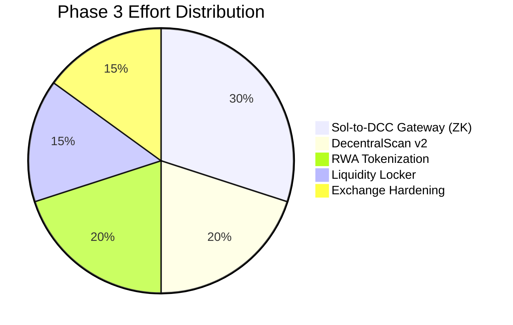

**Goals:**
- Build Sol-to-DCC bridge using zero-knowledge proofs for trustless cross-chain asset transfers (Solana ↔ DCC)
- Deploy Liquidity Locker for DeFi project token vesting and LP lock mechanisms
- Launch DecentralScan v2 (decentralscan.com) with improved block explorer, transaction detail, and analytics
- Build RWA (Real World Asset) tokenization platform on DCC — property, carbon credits, securities
- Harden decentral.exchange: fix CORS wildcard, add CSP headers, non-root Docker, IP spoofing fix
- Ship Data Writer App for on-chain data transactions

**Key Repositories:**
| Project | Repository | Target |
|---------|-----------|--------|
| Sol-to-DCC Gateway | `dylanpersonguy/sol-gateway-dcc-zk-proof` | Aug 2026 |
| Liquidity Locker | `dylanpersonguy/dcc-liquidity-locker` | Jul 2026 |
| RWA Platform | `33imattei33/decentralchain-rwa` | Sep 2026 |
| Data Writer App | `dylanpersonguy/decentralchain-data-writer-app` | Aug 2026 |

**Security Hardening for decentral.exchange:**

| Issue | Severity | Fix |
|-------|----------|-----|
| `Access-Control-Allow-Origin: *` | Critical | Restrict to `decentral.exchange` origin |
| No Content-Security-Policy | High | Add strict CSP headers |
| `set_real_ip_from 0.0.0.0/0` | High | Restrict to known proxy CIDRs |
| Docker runs as root | High | Switch to non-root user |
| 6 test files for 405 source files | Medium | Increase to 80%+ coverage |

---

### Phase 4 — CR Coin Social Economy (Q3–Q4 2026)

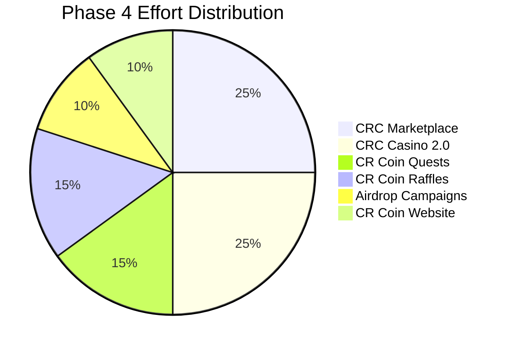

**Goals:**
- Relaunch crcoin.net with updated branding, wallet integration, and ecosystem links
- Ship CR Coin Quests app — gamified tasks that reward users with CR Coin (social currency for Costa Rica)
- Launch CR Coin Raffles app — on-chain raffle system with transparent draws via Ride smart contracts
- Build CRC Marketplace for peer-to-peer trading of DCC-based tokens and NFTs
- Deploy CRC Casino 2.0 with provably fair gaming on DCC blockchain
- Run DCC Airdrop Bot campaigns for community growth and token distribution

**Key Repositories:**
| Project | Repository | Target |
|---------|-----------|--------|
| CR Coin Website | `dylanpersonguy/cr-coin-website` | Aug 2026 |
| CR Coin Quests | `dylanpersonguy/cr-coin-quests-app` | Sep 2026 |
| CR Coin Raffles | `dylanpersonguy/cr-coin-raffles-app` | Sep 2026 |
| CRC Marketplace | `dylanpersonguy/crc-marketplace-app` | Oct 2026 |
| CRC Casino 2.0 | `dylanpersonguy/crc-casino-2.0` | Oct 2026 |
| DCC Airdrop Bot | `dylanpersonguy/dcc-airdrop` | Oct 2026 |

---

### Phase 5 — Ecosystem Growth (Q1 2027)

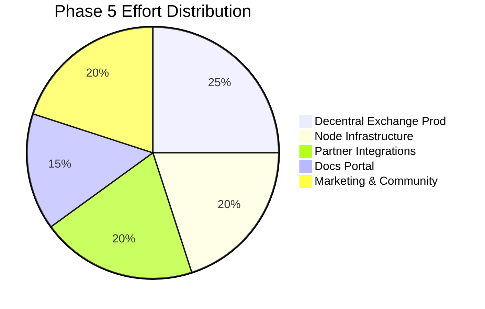

**Goals:**
- Launch decentral.exchange in production with full security hardening, order matching, and DCC/token trading pairs
- Relaunch docs.decentralchain.io with SDK reference, Ride tutorials, API docs, and developer guides
- Scale node infrastructure — additional mainnet/testnet/stagenet nodes, monitoring, and alerting
- Partner integrations — CEX listings, cross-chain bridges, DeFi protocol partnerships
- Community growth via marketing campaigns, developer grants, and hackathons

---

## Ecosystem Project Registry

### Core Infrastructure

| Project | Repository | Live URL | Status |
|---------|-----------|----------|--------|
| DCC Node | `wavesplatform/Waves` (upstream) | — | Running (Scala/JVM) |
| SDK Monorepo | `Decentral-America/*` | npm: `@decentralchain/*` | 22 libs published |
| Cubensis Connect | monorepo: `apps/cubensis-connect` | — | Rebranded, modernizing |
| Exchange | monorepo: `apps/exchange` | decentral.exchange | Security hardening needed |
| Explorer | monorepo: `apps/explorer` | — | Migrated |

### Wallets

| Project | Repository | Platform | Status |
|---------|-----------|----------|--------|
| DCW Android | `33imattei33/DCW-Android` | Android | In development |
| DCW iOS | `33imattei33/DCW-iOS` | iOS | In development |
| DCW Extension | `33imattei33/DCW-Extension` | Chrome/Firefox | In development |

### DeFi

| Project | Repository | Status |
|---------|-----------|--------|
| DCC AMM Swap | `dylanpersonguy/dcc-amm-swap` | In development |
| DCC Staking | `dylanpersonguy/dcc-staking` | In development |
| Liquidity Locker | `dylanpersonguy/dcc-liquidity-locker` | In development |
| Sol-to-DCC Gateway | `dylanpersonguy/sol-gateway-dcc-zk-proof` | In development |
| RWA Tokenization | `33imattei33/decentralchain-rwa` | In development |

### CR Coin Economy

| Project | Repository | Live URL | Status |
|---------|-----------|----------|--------|
| CR Coin Website | `dylanpersonguy/cr-coin-website` | crcoin.net | Active |
| CR Coin Quests | `dylanpersonguy/cr-coin-quests-app` | — | In development |
| CR Coin Raffles | `dylanpersonguy/cr-coin-raffles-app` | — | In development |
| CRC Marketplace | `dylanpersonguy/crc-marketplace-app` | — | In development |
| CRC Casino 2.0 | `dylanpersonguy/crc-casino-2.0` | — | In development |
| DCC Airdrop Bot | `dylanpersonguy/dcc-airdrop` | — | In development |

### Web Properties

| Property | URL | Status |
|----------|-----|--------|
| Main Website | decentralchain.io | Active |
| Block Explorer | decentralscan.com | Active |
| Explorer Beta | beta.decentralscan.com | Beta |
| DEX | decentral.exchange | Pre-production |
| Documentation | docs.decentralchain.io | Active |
| CR Coin | crcoin.net | Active |

### Utilities

| Project | Repository | Status |
|---------|-----------|--------|
| Data Writer App | `dylanpersonguy/decentralchain-data-writer-app` | In development |

---

## Network Infrastructure

| Service | Endpoint | Status |
|---------|----------|--------|
| Mainnet Node | `mainnet-node.decentralchain.io` | Live |
| Testnet Node | `testnet-node.decentralchain.io` | Live |
| Stagenet Node | `stagenet-node.decentralchain.io` | Live |
| Mainnet Matcher | `mainnet-matcher.decentralchain.io` | Live |
| Testnet Matcher | `matcher.decentralchain.io` | Live |
| Data Service API | `api.decentralchain.io` | Live |
| Swap API | `swap-api.decentralchain.io` | Live |
| Identity API | `id.decentralchain.io/api` | Live |

---

## Version History

| Version | Date | Changes |
|---------|------|---------|
| 1.0 | 2026-03-19 | Complete roadmap with real ecosystem data — SDK status, wallets, DeFi, CR Coin, cross-chain, web properties |
| 0.1 | 2026-03-19 | Initial placeholder roadmap |

---

*Last updated: March 19, 2026*
