# DecentralChain Ecosystem Roadmap

> Comprehensive development roadmap for the DecentralChain (DCC) blockchain ecosystem — SDK, wallets, DeFi, cross-chain bridges, CR Coin social economy, and web properties. Maintained by Blockchain Costa Rica / Decentral-America.

---

## Table of Contents

1. [Overview](#overview)
2. [Ecosystem Map](#ecosystem-map)
3. [Development Timeline](#development-timeline)
4. [Workstream Allocation](#workstream-allocation)
5. [Milestone Dependency Flow](#milestone-dependency-flow)
6. [Risk Assessment](#risk-assessment)
7. [Delivery Tracker](#delivery-tracker)
8. [Phase Details](#phase-details)
9. [Ecosystem Project Registry](#ecosystem-project-registry)
10. [Version History](#version-history)

---

## Overview

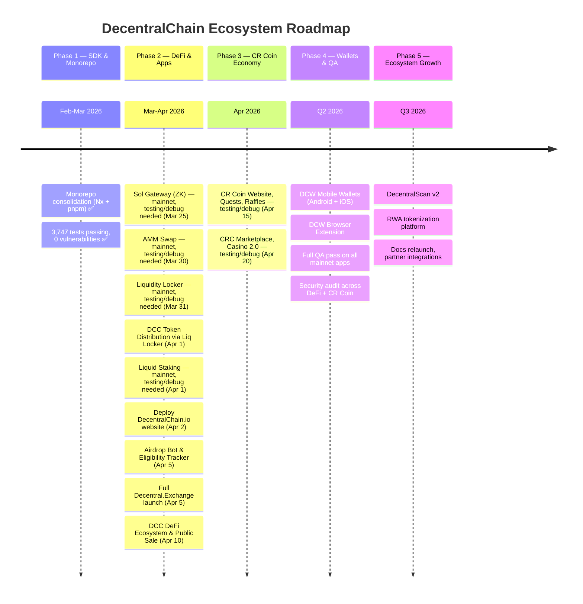

---

## Ecosystem Map

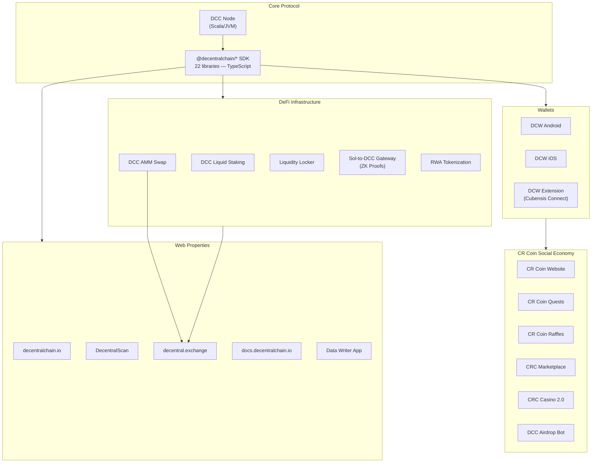

---

## Development Timeline

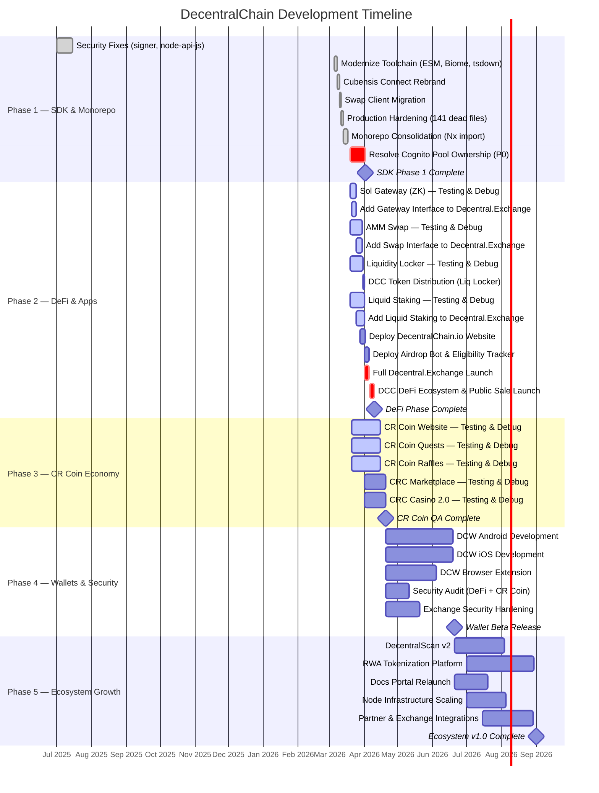

---

## Workstream Allocation

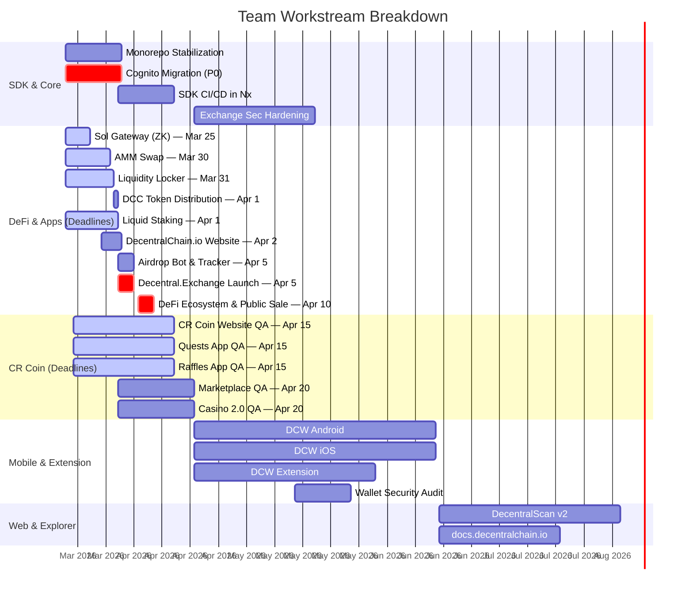

---

## Milestone Dependency Flow

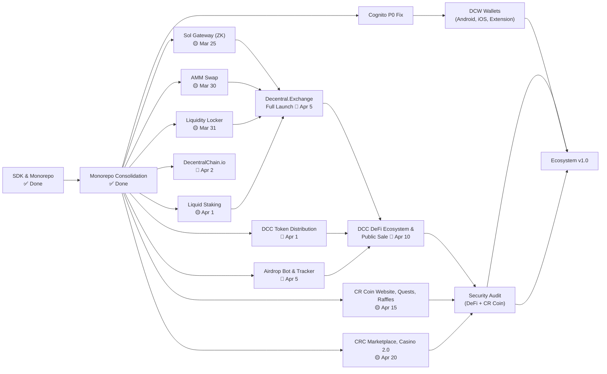

---

## Risk Assessment

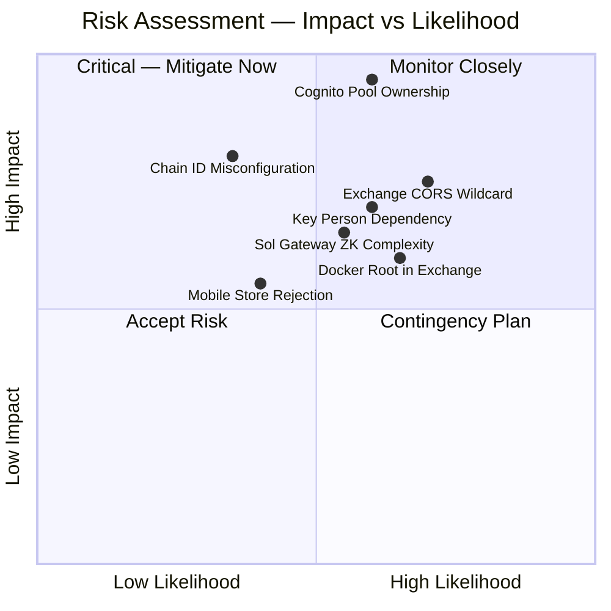

---

## Delivery Tracker

| Phase | Status | Target | Key Deliverables |
|-------|--------|--------|-----------------|
| **Phase 1** — SDK & Monorepo | 🟢 Complete | Mar 2026 | 22 SDK libs migrated, monorepo consolidated, 3,747 tests, 0 vulns |
| **Phase 1b** — Critical Fixes | 🔴 Blocked | Apr 2026 | Cognito P0 resolution |
| **Phase 2** — DeFi & Apps | 🟡 In Progress | Mar 25 – Apr 10 | Sol Gateway, AMM Swap, Liq Locker, Token Distro, Liquid Staking, DecentralChain.io, Airdrop Bot, Decentral.Exchange Launch, DCC Public Sale |
| **Phase 3** — CR Coin Economy | 🟡 In Progress | Apr 15 – Apr 20 | CR Coin Website, Quests, Raffles, CRC Marketplace, Casino 2.0 |
| **Phase 4** — Wallets & Security | ⚪ Not Started | Q2 2026 | DCW Android/iOS/Extension, security audit on all DeFi + CR Coin apps |
| **Phase 5** — Ecosystem Growth | ⚪ Not Started | Q3 2026 | DecentralScan v2, RWA, docs relaunch, partner integrations |

---

## Phase Details

### Phase 1 — SDK & Monorepo (Feb–Mar 2026) — COMPLETE

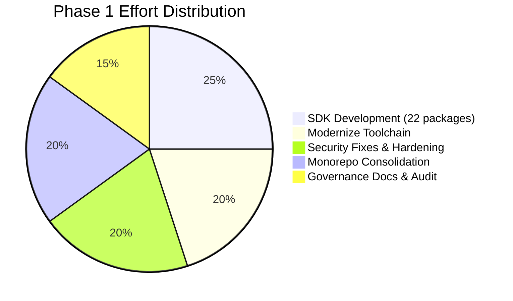

**Completed:**
- Built and published 22 `@decentralchain/*` SDK packages with full git history
- Modernized toolchain: ESM-only, TypeScript 5.9 strict, Biome 2.x, Vitest 4.x, tsdown
- Monorepo consolidated with Nx 22.x + pnpm 10.x (workspace protocol, computation caching)
- 3,747+ tests passing, 0 npm audit vulnerabilities, 0 `Math.random()` / `eval()` in src
- Cubensis Connect wallet extension rebrand (10 locales, icons, network URLs)
- Swap client reverse-engineered and migrated
- 141+ dead files removed, `exactOptionalPropertyTypes` enabled in 19/24 packages

**Open Critical Items (Phase 1b):**

| Priority | Issue | Impact |
|----------|-------|--------|
| **P0** | AWS Cognito pools (`eu-central-1_AXIpDLJQx`, `eu-central-1_6Bo3FEwt5`) — verify DCC ownership or migrate | Could lose access to user seeds |
| **Medium** | `chainId` defaults to `'L'` in transactions & node-api-js, not DCC mainnet `'?'` | Wrong chain targeted by default |

---

### Phase 2 — DeFi & Apps (Mar–Apr 2026) — IN PROGRESS

> Priority phase with hard deadlines. All DeFi projects are on mainnet. Focus is on testing, debugging, integrating into Decentral.Exchange, launching the DCC ecosystem, and running the public sale.

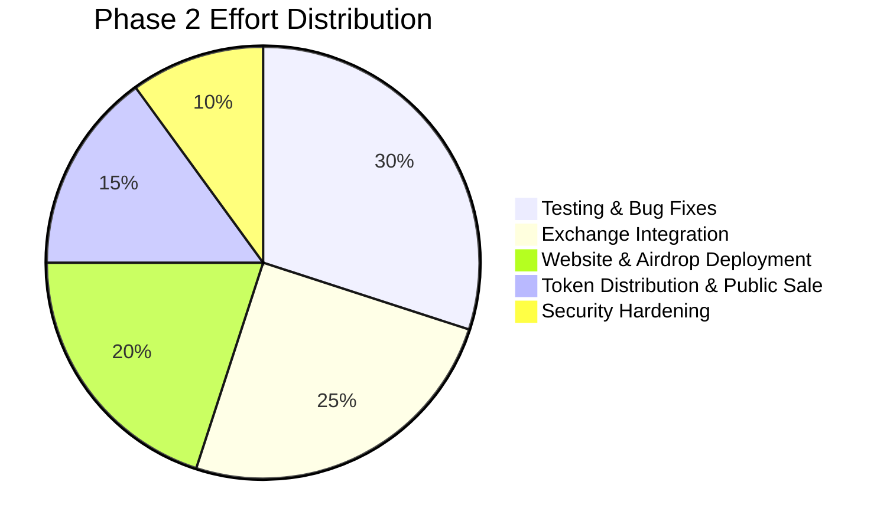

**Deadlines:**

| # | Deliverable | Status | Deadline |
|---|-------------|--------|----------|
| 1 | **Sol Gateway (ZK)** — mainnet, testing/debug needed. Add gateway interface to Decentral.Exchange | 🟡 In Progress | **Mar 25** |
| 2 | **AMM Swap** — mainnet, testing/debug needed. Add Swap interface to Decentral.Exchange | 🟡 In Progress | **Mar 30** |
| 3 | **Liquidity Locker** — mainnet, testing/debug needed | 🟡 In Progress | **Mar 31** |
| 4 | **Organize DCC Token Distribution** — Lock DCC coins using Liquidity Locker | 📅 Scheduled | **Apr 1** |
| 5 | **Liquid Staking** — mainnet, testing/debug needed. Add liquid staking interface to Decentral.Exchange | 🟡 In Progress | **Apr 1** |
| 6 | **Deploy new DecentralChain.io website** — with roadmap, token distribution, etc. | 📅 Scheduled | **Apr 2** |
| 7 | **Deploy Airdrop Bot and Eligibility Tracker** | 📅 Scheduled | **Apr 5** |
| 8 | **Fully Launched NEW Decentral.Exchange** — all new features: Liq Lock, Gateway, Swap, Liq Staking, etc. | 📅 Scheduled | **Apr 5** |
| 9 | **Full Launch of DCC DeFi Ecosystem & DCC Public Sale** | 📅 Scheduled | **Apr 10** |

**Key Repositories:**

| Project | Repository | Mainnet |
|---------|-----------|:-------:|
| Sol-to-DCC Gateway | `dylanpersonguy/sol-gateway-dcc-zk-proof` | ✅ |
| DCC AMM Swap | `dylanpersonguy/dcc-amm-swap` | ✅ |
| Liquidity Locker | `dylanpersonguy/dcc-liquidity-locker` | ✅ |
| DCC Liquid Staking | `dylanpersonguy/dcc-staking` | ✅ |
| Data Writer App | `dylanpersonguy/decentralchain-data-writer-app` | ✅ |
| DCC Airdrop Bot | `dylanpersonguy/dcc-airdrop` | ✅ |

**Goals:**
- Complete testing & debugging on all DeFi contracts (Sol Gateway, AMM Swap, Liquidity Locker, Liquid Staking)
- Integrate Gateway, Swap, and Liquid Staking interfaces into Decentral.Exchange
- Lock DCC coins via Liquidity Locker for organized token distribution
- Deploy the new DecentralChain.io website with roadmap, token distribution info, and ecosystem overview
- Launch Airdrop Bot with eligibility tracking
- Ship the fully featured Decentral.Exchange with all DeFi features
- Execute full DCC DeFi ecosystem launch and public sale

---

### Phase 3 — CR Coin Economy (Apr 2026) — IN PROGRESS

> CR Coin social economy projects are on mainnet. Focus is testing, bug fixes, and UX polish.

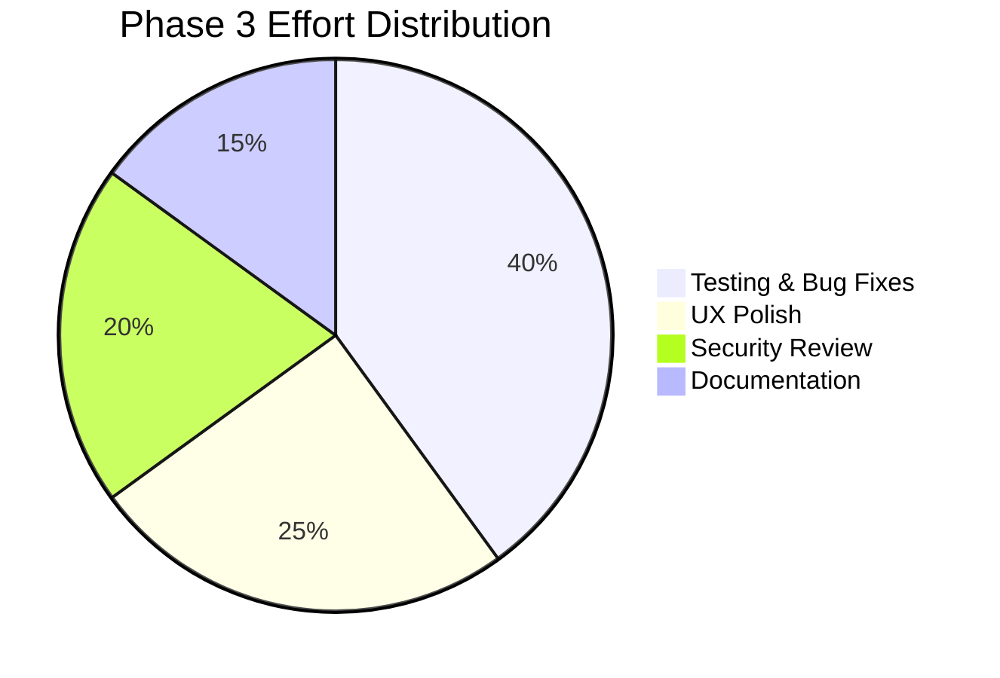

**Deadlines:**

| # | Deliverable | Status | Deadline |
|---|-------------|--------|----------|
| 1 | **CR Coin Website, Quests, Raffles** — testing/debug | 🟡 In Progress | **Apr 15** |
| 2 | **CRC Marketplace, Casino 2.0** — testing/debug | 🟡 In Progress | **Apr 20** |

**Key Repositories:**

| Project | Repository | Mainnet |
|---------|-----------|:-------:|
| CR Coin Website | `dylanpersonguy/cr-coin-website` | ✅ |
| CR Coin Quests | `dylanpersonguy/cr-coin-quests-app` | ✅ |
| CR Coin Raffles | `dylanpersonguy/cr-coin-raffles-app` | ✅ |
| CRC Marketplace | `dylanpersonguy/crc-marketplace-app` | ✅ |
| CRC Casino 2.0 | `dylanpersonguy/crc-casino-2.0` | ✅ |

**Goals:**
- Comprehensive test suites for all CR Coin projects
- Verify on-chain raffle draw fairness and quest reward distribution
- Security review of marketplace transaction flows and casino game logic
- UX testing across all CR Coin apps for consistent user experience

---

### Phase 4 — Wallets & Security Audit (Q2 2026)

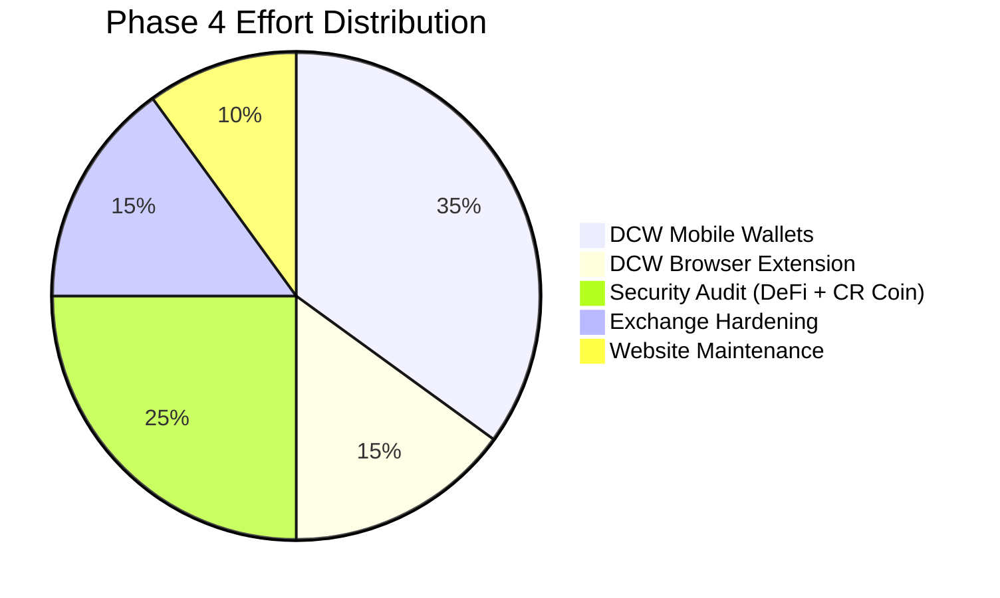

**Goals:**
- Launch DCW (DecentralChain Wallet) on Android and iOS with seed management, transaction signing, and DCC token support
- Ship DCW browser extension (evolution of Cubensis Connect — webpack → Vite, Babel → native TS)
- Run security audit across all mainnet apps (DeFi + CR Coin) before public launch announcements
- Harden decentral.exchange: fix CORS wildcard, add CSP headers, non-root Docker, IP spoofing fix

**Key Repositories:**
| Project | Repository | Target |
|---------|-----------|--------|
| DCW Android | `33imattei33/DCW-Android` | Jun 2026 |
| DCW iOS | `33imattei33/DCW-iOS` | Jun 2026 |
| DCW Extension | `33imattei33/DCW-Extension` | May 2026 |

**Security Hardening for decentral.exchange:**

| Issue | Severity | Fix |
|-------|----------|-----|
| `Access-Control-Allow-Origin: *` | Critical | Restrict to `decentral.exchange` origin |
| No Content-Security-Policy | High | Add strict CSP headers |
| `set_real_ip_from 0.0.0.0/0` | High | Restrict to known proxy CIDRs |
| Docker runs as root | High | Switch to non-root user |
| 6 test files for 405 source files | Medium | Increase to 80%+ coverage |

---

### Phase 5 — Ecosystem Growth (Q3 2026)

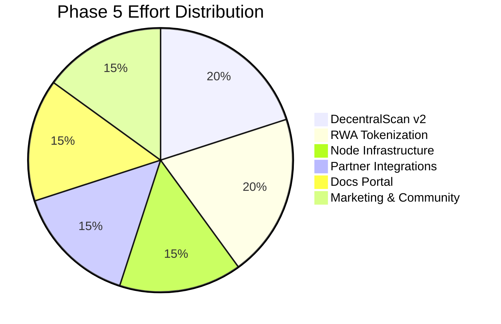

**Goals:**
- Ship DecentralScan v2 with improved block explorer, analytics, and transaction detail
- Launch RWA (Real World Asset) tokenization platform on DCC
- Relaunch docs.decentralchain.io with SDK reference, Ride tutorials, API docs, and developer guides
- Scale node infrastructure — additional mainnet/testnet/stagenet nodes, monitoring, and alerting
- Partner integrations — CEX listings, cross-chain bridges, DeFi protocol partnerships
- Community growth via marketing campaigns, developer grants, and hackathons

---

## Ecosystem Project Registry

### Core Infrastructure

| Project | Repository | Live URL | Status |
|---------|-----------|----------|--------|
| DCC Node | DecentralChain Node | — | Running (Scala/JVM) |
| SDK Monorepo | `Decentral-America/*` | npm: `@decentralchain/*` | 22 libs published |
| Cubensis Connect | monorepo: `apps/cubensis-connect` | — | Rebranded, modernizing |
| Exchange | monorepo: `apps/exchange` | decentral.exchange | Security hardening needed |
| Explorer | monorepo: `apps/explorer` | — | Migrated |

### Wallets

| Project | Repository | Platform | Status |
|---------|-----------|----------|--------|
| DCW Android | `33imattei33/DCW-Android` | Android | In development |
| DCW iOS | `33imattei33/DCW-iOS` | iOS | In development |
| DCW Extension | `33imattei33/DCW-Extension` | Chrome/Firefox | In development |

### DeFi

| Project | Repository | Status |
|---------|-----------|--------|
| Sol-to-DCC Gateway | `dylanpersonguy/sol-gateway-dcc-zk-proof` | 🟡 Mainnet — Deadline Mar 25 |
| DCC AMM Swap | `dylanpersonguy/dcc-amm-swap` | 🟡 Mainnet — Deadline Mar 30 |
| Liquidity Locker | `dylanpersonguy/dcc-liquidity-locker` | 🟡 Mainnet — Deadline Mar 31 |
| DCC Liquid Staking | `dylanpersonguy/dcc-staking` | 🟡 Mainnet — Deadline Apr 1 |
| RWA Tokenization | `33imattei33/decentralchain-rwa` | In development |

### CR Coin Economy

| Project | Repository | Live URL | Status |
|---------|-----------|----------|--------|
| CR Coin Website | `dylanpersonguy/cr-coin-website` | crcoin.net | 🟡 Mainnet — Deadline Apr 15 |
| CR Coin Quests | `dylanpersonguy/cr-coin-quests-app` | — | 🟡 Mainnet — Deadline Apr 15 |
| CR Coin Raffles | `dylanpersonguy/cr-coin-raffles-app` | — | 🟡 Mainnet — Deadline Apr 15 |
| CRC Marketplace | `dylanpersonguy/crc-marketplace-app` | — | 🟡 Mainnet — Deadline Apr 20 |
| CRC Casino 2.0 | `dylanpersonguy/crc-casino-2.0` | — | 🟡 Mainnet — Deadline Apr 20 |
| DCC Airdrop Bot | `dylanpersonguy/dcc-airdrop` | — | 📅 Deadline Apr 5 |

### Web Properties

| Property | URL | Status |
|----------|-----|--------|
| Main Website | decentralchain.io | Active — Redesign by Apr 2 |
| Block Explorer | decentralscan.com | Active |
| Explorer Beta | beta.decentralscan.com | Beta |
| DEX | decentral.exchange | Full launch Apr 5 |
| Documentation | docs.decentralchain.io | Active |
| CR Coin | crcoin.net | Active |

### Utilities

| Project | Repository | Status |
|---------|-----------|--------|
| Data Writer App | `dylanpersonguy/decentralchain-data-writer-app` | Mainnet, QA needed |

---

## Network Infrastructure

| Service | Endpoint | Status |
|---------|----------|--------|
| Mainnet Node | `mainnet-node.decentralchain.io` | Live |
| Testnet Node | `testnet-node.decentralchain.io` | Live |
| Stagenet Node | `stagenet-node.decentralchain.io` | Live |
| Mainnet Matcher | `mainnet-matcher.decentralchain.io` | Live |
| Testnet Matcher | `matcher.decentralchain.io` | Live |
| Data Service API | `api.decentralchain.io` | Live |
| Swap API | `swap-api.decentralchain.io` | Live |
| Identity API | `id.decentralchain.io/api` | Live |

---

## Version History

| Version | Date | Changes |
|---------|------|---------|
| 2.0 | 2026-03-21 | Roadmap restructured: Phase 2 rewritten with hard deadlines (Mar 25 – Apr 10), Phase 3 deadlines added (Apr 15 – Apr 20), cleaned up branding |
| 1.1 | 2026-03-19 | Updated 12 projects to 90% complete (mainnet deployed, QA/debug phase). Restructured phases to reflect actual progress |
| 1.0 | 2026-03-19 | Complete roadmap with real ecosystem data — SDK status, wallets, DeFi, CR Coin, cross-chain, web properties |
| 0.1 | 2026-03-19 | Initial placeholder roadmap |

---

*Last updated: March 21, 2026*
